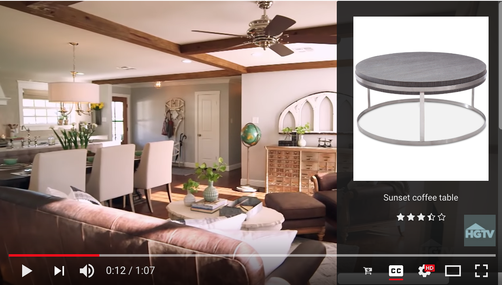

# SEEYE

Minimum Viable Product for SeeYe Tech

Front end (iOS/Andrioid) + Back end database (AWS MySQL)

* Component 1: iOS/Android app that links to a tv**

* Component 2: while watching a streaming tv show on your cell phone**

* Component 3: while watching videos on your laptop**

 

# Account Info

AWS Console Login: seeyetech.signin.aws.amazon.com/console

Account ID: seeyetech

IAM Username: Administrator

 

MySQL Database Endpoint: mysql-instance1.cqilpo3gbwln.us-east-1.rds.amazonaws.com

Port: 3306

Username: Administrator

Recommend download [MySQL Workbench](https://dev.mysql.com/downloads/workbench/)

# Component 3

Based on Youtube and Chrome

Add a SeeYe button on Youtube web video player, as the following picture shows:

